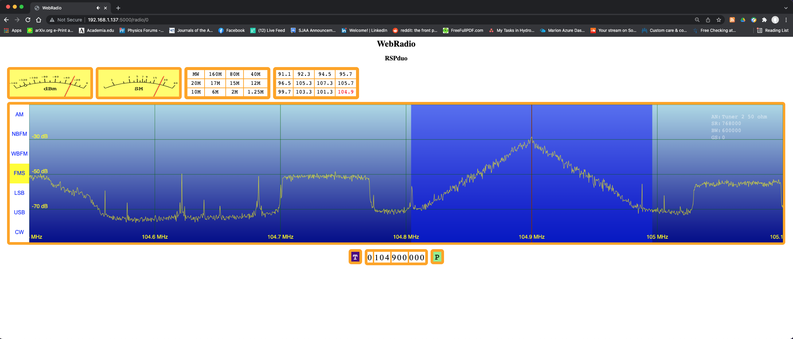

# WebRadio

This project fills a hole in my needs for a usable Software Defined Radio application.
Over the years it's been a struggle to find and maintain usable radio software on the
Mac and Linux. This void exists for several reasons. Chief amongst these is my loathing
for Windows which seems to host most radio software. This is especially true for SDRPlay
radios. SDRPlay offers SDRuno which is a truly fine option. Like their hardware, SDRuno 
offers a rich array of features. Which brings me to my second problem, my radio is 
upstairs while my preferred listening is downstairs. 

I'd like, if I could, run my radios remotely. Now, there are again options. The ones I've 
found all send the full IQ data stream over the local net to a program that runs on my 
desktop. This puts the all the onus of demodulating, displaying and playing the 
IQ data stream on the local machine. Gee, I hope this local program compiles. Well, on a 
Mac, it usually doesn't at least without a fight. And, if it does, it likely won't for long.

Finally, sending raw IQ data is the worst possible approach IMO. IQ samples at 2MHz or more
is a lot of network bandwidth sucked up that's just not required for the job. All that is
require is 15-25 frames/sec of power spectrum and audio data. This is more than 10 time 
fewer bytes per second on my network than one needs to send the IQ data directly.

WebRadio is solution to this problem. WebRadio is a python3 http/socket.io server that 
serves power spectrum and audio data to be rendered in a browser window. All required HTTP 
and JavaScript needed for rendering is supplied (served) by WebRadio. I've compiled and
run WebRadio on MacOs (Monterey) and Linux (Ubuntu and Ubuntu-Mate). I see no reason 
WebRadio would not to work on Windows as well.

# Installation

It is recommended to use a virtual or non-system python environment. My preference is 
to use pyenv which hides the system pythons from inadvertent use. I've installed pyenv
and done the required .bashrc/.profile mods needed to make everything python transparent.  
 
This server uses the following:

- Python 3
- [SDRpaly API](https://sdrplay.com) for the platform running WebRadio 
- [SoapySDR](https://github.com/pothosware/SoapySDR)  python support
- [SoapySDRPlay3](https://github/pothosware/SoapySDRPlay3)
- [SoaptRLTSDR](https://github.com/pothosware/SoapyRTLSDR)
- requests (pip install requests)
- Flask (pip install flask)
- Flask-socketio (pip install flask-socketio)
- eventlet (pip install eventlet)
- numpy (pip install numpy)
- scipy (pip install scipy)

In addition one also needs the JavaScript libraries. 

- socket.io.js
- jquery.js

For now these are in the git repository. Proper way to deal with this is to install npm 
and associated machinery. However, to get Flask to serve these it was simplest to just 
add them to the repository.

## Web Security

In a word, there currently is none. It could be added. I see the main use case of WebRadio 
as operating behind a firewall on a local network so security seems not needed. I could be
wrong. In any case, I do not recommend letting WebRadio be on the Web at large.

## SoapySRD installation

The SoapySDR build insists on installing the python support to /usr/local which doesn't 
help with a virtual environment at least on the way I have things configured. I've simply
moved `_SoapySDR.so` and `SoapySDR.py` to a directory, `site-packages/sopay_sdr`, in 
my python search path. In any event, one must be able to `from soapy_sdr import SoapySDR`
from the python prompt.  

## Current Limitations

- SoapySDR's gain abstraction is not well implemented in the current UI. From the start this 
has been a learning exercise for Python, HTTP, CSS and JavaScript for me so nothing is 
likely done well. On the upside, hacking the UI is just a matter of changing some HTTP and
JavaScript. 

- An auto gain is needed for the AM, LSB, USB modems. At present the PCM audio data is simply 
scaled by a constant. I'm thinking one should use the RF power level to set the PCM gain 
scale factor. This is especially true for Airband push to talk where RF (and therefore the
PCM) level. Well, this needs work. 

- Some kind of programmable preset switches.

